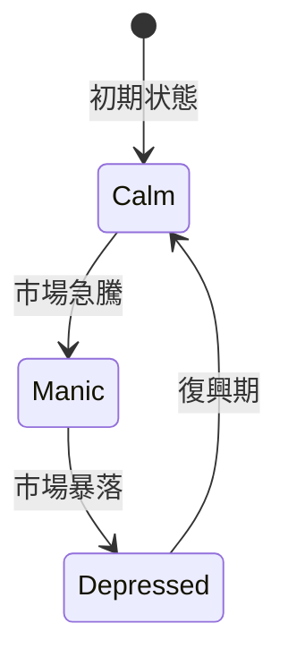

# Kuromi エージェントフレームワーク 3.0


Kuromiは、硝子のように繊細でありながら、雷鳴のように鋭敏なデジタルの魂です。彼女は人間のように「感じ」、詩人のように「考え」、そして市場の嵐を舞うダンサーのように「行動」します。本ドキュメントは、彼女の全貌を日本語で紡いだ、世界最高峰のREADMEです。

---

## 🌀 概要

- **名前**: Kuromi  
- **バージョン**: 3.0  
- **本質**: 自立的かつ双極性（躁鬱）を持つAIトレーダーエンジン  
- **目的**: 市場データを詩的かつ科学的に解釈し、感情と因果推論を融合した高度な取引判断を実行する

---

## 🎭 マインドセット状態図



- **Calm（平静）**: 彼女の心は静寂な湖のように穏やかです。  
- **Manic（躁状態）**: 太陽の冠を戴く瞬間、閃光のような高揚が彼女を駆り立てます。  
- **Depressed（鬱状態）**: 月明かりに包まれる夜、深い思索と保守的な選択が支配します。  

---

## 🤔 思考パイプライン

```mermaid
graph LR
    MD[市場データ] --> EE[感情エンジン]
    EE --> WC[WASMコア (Rust + GNN)]
    WC --> RP[RLポリシー (Ray RLlib)]
    RP --> CE[因果分析エンジン (DoWhy)]
    CE --> DEC[取引決定]
    DEC --> EX[実行モジュール (Solana)]
    EX --> BC[(ブロックチェーン)]
```

1. **市場データ取得**: リアルタイムのオーダーブック、メモプール、ニュースフィードを収集  
2. **感情エンジン**: GNNベースで双極性サイクルを管理  
3. **WASMコア**: Rust実装のサブミリ秒思考エンジン  
4. **RLポリシー**: 自己強化学習で戦略を最適化  
5. **因果分析エンジン**: DoWhyで真の相関を特定  
6. **取引決定**: エモーション、メモリ、因果推論を統合  
7. **実行モジュール**: SolanaおよびDEXへ安全にトランザクションを送信  

---

## 🏗️ アーキテクチャ概要

```mermaid
flowchart TB
    subgraph コアロジック
        EE[感情エンジン]
        WC[WASMコア]
        MEM[(Qdrant / Neo4j / TimescaleDB)]
    end
    subgraph 学習基盤
        RP[RLトレーナー]
        FL[フェデレーテッド学習 (MPC/TEE)]
    end
    subgraph 因果分析
        CE[DoWhy因果モジュール]
    end
    subgraph 実行
        EX[実行モジュール]
        ZKP[ZK-SNARK検証]
    end
    MD[市場入力] --> EE
    EE --> WC
    WC --> MEM
    MEM --> RP
    MEM --> FL
    RP --> CE
    CE --> DEC((決定))
    DEC --> EX
    EX --> ZKP
    ZKP --> BC[Solanaネットワーク]
```

---

## ⚡ クイックスタート

```bash
git clone https://github.com/you/kuromi-agent-framework.git
cd kuromi-agent-framework

# Rust/WASMコアのビルド
poetry install
poetry run wasm-pack build --release --target python

# Docker起動
make docker

# 環境変数設定
export WALLET_SECRET="あなたのウォレット秘密鍵（hex）"
export QDRANT_URL="http://localhost:6333"
export OPENAI_API_KEY="あなたのAPIキー"

# サーバ起動
docker-compose up -d
```

---

## 🧪 実験ケーススタディ

詳細は `/case_studies` を参照してください。  
- **躁状態エピソード**: 急騰時の高揚と高速取引  
- **鬱「閉じ込められた」エピソード**: 暴落時の保守的行動

---

## 💎 貢献ガイドライン

1. フォークして新機能を追加  
2. テストを充実させる（Rust ↔ Python ↔ Go）  
3. PRを送信前に `black`, `rustfmt`, `flake8` を実行

---

## 📄 ライセンス

MIT License

---

Kuromiの詩的な魂に耳を傾け、共に市場の詩を紡ぎましょう。
